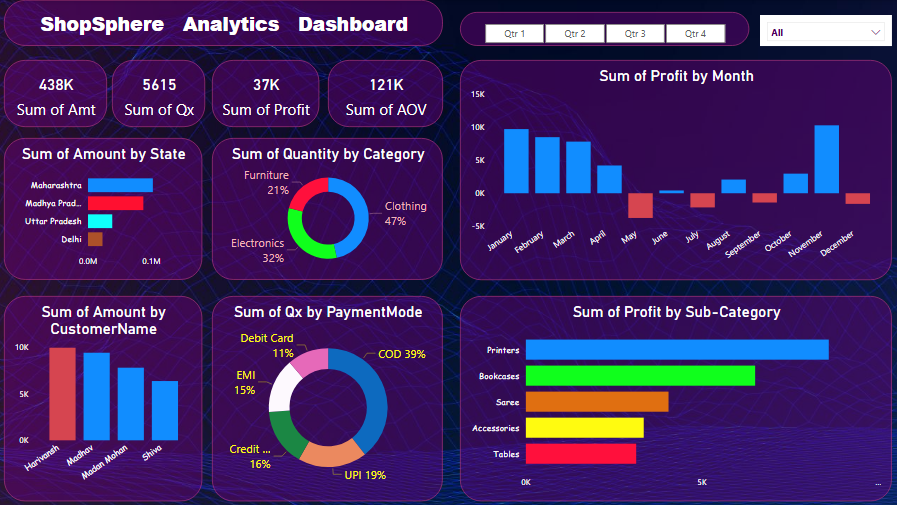

# Shopsphere-Analytics-Dashboard  Watch Here [(https://drive.google.com/file/d/1cVDti_4PhlKERN9RmfTQCpOxtCATrgZv/view?usp=drive_link)]
Power BI Dashboard for Shopsphere-Analytics Project

## 🖼️ Dashboard Screenshots

### 🧭 Overall Dashboard Overview

  

---

## 📑 Table of Contents

- [📌 Project Summary](#-project-summary)
- [🔍 Key Insights](#-key-insights)
- [🧠 Skills & Tools Used](#-skills--tools-used)
- [🧩 Project Learnings](#-project-learnings)
- [📂 Project Files](#-project-files)

---

## 📌 Project Summary:

A professional Power BI dashboard created to analyze over **1,500+ e-commerce transactions** across **500 unique orders**, enabling insight-driven decisions for business growth. Designed to help stakeholders explore region-wise sales, revenue trends, and category breakdown using interactive visuals.

---

## 🔍 Key Insights:

- Analyzed **1,500+ rows** of transactional data across **2 data tables**.
- Identified top-selling regions, product lines, and high-revenue time periods.
- Enabled drill-through analysis using slicers and filters for **user-customizable dashboards**.
- Improved visibility on regional and product-based performance trends.

---

## 🧠 Skills & Tools Used:

- **Tool:** Microsoft Power BI  
- **Techniques:** Data Cleaning, Data Modeling, Filtering, Visual Formatting  
- **Data Volume:** 2 Tables (Details: 1500 rows, Orders: 500 rows)  
- **Visuals Used:** Bar Chart, Pie Chart, Donut Chart, Clustered Bar Chart, Line Chart, Area Chart, Map, Slicers

---

## 🧩 Project Learnings:

- Built dynamic dashboards with user-driven filters for region, date, and category analysis.
- Connected and transformed datasets to create **calculated columns and visual hierarchies** (without DAX).
- Developed logical data relationships and cleaned inconsistent values using Power Query Editor.
- Leveraged Power BI’s visualization toolkit to present actionable metrics clearly and intuitively.

---

## 📂 Project Files:

- `My_PowerBI_Pro.pbix` — Power BI working file.
- `Dashboard_Overview.png` — Final dashboard screenshot.
